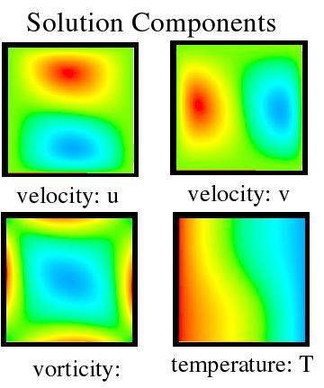

# What is `TS`?

`TS` solves differential equations
$$ \dot u = G(t,u), $$
differential algebraic equations,
$$ F(t, u, \dot u) = 0, $$
and the combined representation
$$ F(t, u, \dot u) = G(t, u). $$

---
# Common examples
## Advection equation
$$ \dot u = - \mathbf w \cdot \nabla u $$
where $\mathbf w$ is a divergence-free vector field.
## Heat/diffusion equation
$$ \dot u = \nabla\cdot (\kappa \nabla u) $$
where $\kappa$ is SPD.

---
# The interface
```c
TS ts;
Vec u,r;
TSCreate(comm,&ts);
TSSetDM(ts,da);          // for multigrid and to use in callbacks
TSSetRHSFunction(ts,r,MyRHSFunction,context);
TSSetDuration(ts,maxsteps,maxtime);
TSSetFromOptions(ts);
SetInitialCondition(&u); // user
TSSolve(ts,u);
```

---
# The RHSFunction: $\dot U = G(t, U)$
```c
PetscErrorCode G(TS ts,PetscReal time,Vec U,Vec F,void *vctx) {
  Vec Uloc;
  PetscInt i,xs,xm;
  PetscScalar *u,*f;
  DM da;

  TSGetDM(ts, &dm);
  DMGetLocalVector(dm, &Uloc);
  DMGlobalToLocal(dm, U, INSERT_VALUES, Uloc);
  DMDAGetCorners(da,&xs,0,0,&xm,0,0);
  DMDAVecGetArray(da,Uloc,&u);
  DMDAVecGetArray(da,F,&f);
  for (i=xs; i<xs+xm; i++) {
    f[i] = (u[i+1] - u[i-1])/(2*dx);
  }
```

---
# Building an example
```bash
module load petsc
cp -r $PETSC_DIR/share/petsc/examples .
cd examples/src/ts/examples/tutorials
make -B ex9
```

## Why `-B`?

       -B, --always-make
            Unconditionally make all targets.

---
# Explicit methods

### `-ts_type`

* **"euler"**: Forward Euler
* **"rk"**: Explicit Runge-Kutta with adaptive error control
* **"ssp"**: Strong Stability Preserving Runge-Kutta

---
# Running: 1D advection using a TVD finite volume method

    $ ./ex9 -ts_monitor -ts_type ssp     # ssp is the default
    Solution range [-1.00000, 1.00000] with extrema at 0 and 25, mean -0.00000, ||x||_TV  0.08000
    Final time 10.00800, steps 278
    Solution range [-0.99981, 0.99981] with extrema at 5 and 30, mean -0.00000, ||x||_TV  0.07998

If you're running locally (with X11)

    ./ex9 -ts_monitor -ts_monitor_draw_solution -draw_pause 0.1

---
# How big are the time steps?

    $ ./ex9 -ts_monitor -ts_type ssp -ts_monitor
    [...]
    276 TS dt 0.036 time 9.936
    277 TS dt 0.036 time 9.972
    278 TS dt 0.036 time 10.008
    Final time 10.00800, steps 278
    Solution range [-0.99981, 0.99981] with extrema at 5 and 30, mean -0.00000, ||x||_TV  0.07998

---
# Adaptivity

* `-ts_adapt_type` <basic>: Algorithm to use for adaptivity (one of) none basic dsp cfl glee history (TSAdaptSetType)

  * **"basic"** standard order/accuracy based error control
  * **"dsp"** PI/PID controllers from digital signal processing (Lisandro)
  * **"cfl"** using Courant-Friedrichs-Levy (CFL) criteria

Bounding time step sizes

    -ts_adapt_dt_min <1e-20>: Minimum time step considered (TSAdaptSetStepLimits)
    -ts_adapt_dt_max <1e+20>: Maximum time step considered (TSAdaptSetStepLimits)


* Run with `-help | grep ts_adapt` for more

---
# RK with adaptivity

    $ ./ex9 -ts_type rk
    Solution range [-1.00000, 1.00000] with extrema at 0 and 25, mean -0.00000, ||x||_TV  0.08000
    Final time 10.00814, steps 547
    Solution range [-1.00000, 1.00000] with extrema at 6 and 31, mean -0.00000, ||x||_TV  0.08000

    $ ./ex9 -ts_type rk -ts_adapt_monitor
    Solution range [-1.00000, 1.00000] with extrema at 0 and 25, mean -0.00000, ||x||_TV  0.08000
    TSAdapt basic rk 0:3bs step   0 rejected t=0          + 3.600e-02 dt=1.010e-02  wlte=   33  wltea=   -1 wlter=   -1
    TSAdapt basic rk 0:3bs step   0 accepted t=0          + 1.010e-02 dt=1.552e-02  wlte=0.201  wltea=   -1 wlter=   -1
    TSAdapt basic rk 0:3bs step   1 rejected t=0.0100984  + 1.552e-02 dt=1.011e-02  wlte= 2.64  wltea=   -1 wlter=   -1
    TSAdapt basic rk 0:3bs step   1 accepted t=0.0100984  + 1.011e-02 dt=9.535e-03  wlte=0.869  wltea=   -1 wlter=   -1
    TSAdapt basic rk 0:3bs step   2 accepted t=0.0202081  + 9.535e-03 dt=1.048e-02  wlte= 0.55  wltea=   -1 wlter=   -1
    TSAdapt basic rk 0:3bs step   3 rejected t=0.029743   + 1.048e-02 dt=6.589e-03  wlte= 2.93  wltea=   -1 wlter=   -1
    TSAdapt basic rk 0:3bs step   3 accepted t=0.029743   + 6.589e-03 dt=8.492e-03  wlte=0.341  wltea=   -1 wlter=   -1

    TSAdapt basic rk 0:3bs step 546 accepted t=9.98866    + 1.949e-02 dt=1.919e-02  wlte=0.763  wltea=   -1 wlter=   -1
    Final time 10.00814, steps 547
    Solution range [-1.00000, 1.00000] with extrema at 6 and 31, mean -0.00000, ||x||_TV  0.08000

---
# RK without adaptivity

    $ ./ex9 -ts_type rk -ts_adapt_monitor -ts_adapt_type none
    Solution range [-1.00000, 1.00000] with extrema at 0 and 25, mean -0.00000, ||x||_TV  0.08000
    TSAdapt none rk 0:3bs step   0 accepted t=0          + 3.600e-02 dt=3.600e-02 
    TSAdapt none rk 0:3bs step   1 accepted t=0.036      + 3.600e-02 dt=3.600e-02 
    TSAdapt none rk 0:3bs step   2 accepted t=0.072      + 3.600e-02 dt=3.600e-02 
    TSAdapt none rk 0:3bs step   3 accepted t=0.108      + 3.600e-02 dt=3.600e-02 

    TSAdapt none rk 0:3bs step 276 accepted t=9.936      + 3.600e-02 dt=3.600e-02 
    TSAdapt none rk 0:3bs step 277 accepted t=9.972      + 3.600e-02 dt=3.600e-02 
    Final time 10.00800, steps 278
    Solution range [-1.00042, 1.00042] with extrema at 11 and 36, mean -0.00000, ||x||_TV  0.08003

---
# Globalization by continuation

We want to solve $G(u) = 0$, but Newton stagnates.

* Try a grid sequence: solve on coarse grid, interpolate, solve
* Try a parameter continuation: solve with small Reynolds number,
  increase and solve again
* Pseudotransient continuation: integrate $\dot u = G(u)$ to steady state
  * DAE variant: $M \dot u = G(u)$ with $V$ singular

---
# Pseudotransient continuation for thermal/lid-driven cavity
.pull-left[
$$ - \nabla^2 u - \omega_y = 0 $$
$$ - \nabla^2 v + \omega_x = 0 $$
$$ \omega_t - \nabla^2 \omega + \mathbf u \cdot \nabla\omega - \mathrm{Gr} T_x = 0 $$
$$ T_t - \nabla^2 T + \mathrm{Pr} ( u T_x + v T_y ) = 0 $$]
.pull-right[]

.footnote.left[See Coffey, Kelley, and Keyes (2003)]

---
# Running

    $ salloc -N 1 -n 4 -p highcpu-16 mpiexec ./ex26 -ts_type pseudo \
        -pc_type mg -pc_mg_galerkin -da_refine 6 -pc_mg_levels 5 \
        -mg_levels_ksp_type chebyshev -mg_levels_pc_type jacobi \
        -cuda_view -ts_monitor -ksp_converged_reason -ts_view -log_view \
        -dm_mat_type aijcusparse -dm_vec_type cuda

    193x193 grid, lid velocity = 2.68464e-05, prandtl # = 1., grashof # = 1.                                                                                                                       
    0 TS dt 9650. time 0.
        Linear solve converged due to CONVERGED_RTOL iterations 9
    1 TS dt 10615. time 10615.
        Linear solve converged due to CONVERGED_RTOL iterations 7
    2 TS dt 183703. time 194318.
        Linear solve converged due to CONVERGED_RTOL iterations 7
    3 TS dt 3.04654e+07 time 3.06598e+07
        Linear solve converged due to CONVERGED_RTOL iterations 9
    4 TS dt 1.08875e+10 time 1.09181e+10
        Linear solve converged due to CONVERGED_RTOL iterations 11
    5 TS dt 3.99672e+14 time 3.99683e+14
    TS Object: 1 MPI processes

---
# Next steps

* Many other **implicit** and **IMEX** integrators
* [**Multi-rate** integrators](https://www.mcs.anl.gov/petsc/petsc-master/docs/manualpages/TS/TSMPRK.html)
* [**Symplectic** integrators](https://www.mcs.anl.gov/petsc/petsc-current/docs/manualpages/TS/TSBasicSymplectic.html) for Hamiltonian systems
* [`TSAdjointSolve`](https://www.mcs.anl.gov/petsc/petsc-current/docs/manualpages/Sensitivity/TSAdjointSolve.html) computes sensitivity of outputs with respect to inputs/forcing/parameters
* [`TSSetEventHandler`](https://www.mcs.anl.gov/petsc/petsc-current/docs/manualpages/TS/TSSetEventHandler.html#TSSetEventHandler) flexible handling/location of algebraically-defined "events"
* [PETSc/TS: A Modern Scalable ODE/DAE Solver Library](https://arxiv.org/pdf/1806.01437.pdf)

--
# Questions?

.footnote[Slides created via the R package [**xaringan**](https://github.com/yihui/xaringan).]
